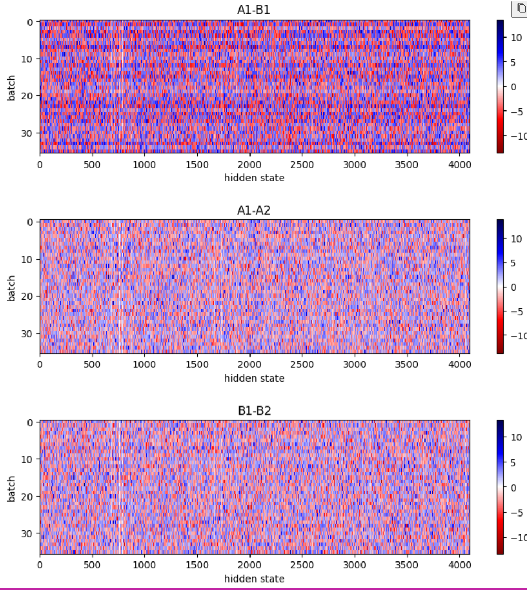

# 2024-07-06 16:21:34


```sh
# run SFT
python -u train.py \
    model=blank_model model.name_or_path=/PATH/TO/LLAMA/WEIGHTS \
    model.block_name=LlamaDecoderLayer \
    datasets=[hh,shp] \
    loss=sft exp_name=anthropic_shp_sft_llama_7b \
    gradient_accumulation_steps=2 batch_size=64 \
    eval_batch_size=32 \
    trainer=FSDPTrainer \
    sample_during_eval=false

```


this fork adds drpo https://github.com/eric-mitchell/direct-preference-optimization/compare/main...haobozhang:direct-preference-optimization:main

ompute the DPO loss for Plackett-Luce model https://github.com/spacegoing/pldpo/commit/80d7f1c1e0042f0858461b338cc4f5de7040a635


LORA https://github.com/gzliyu/direct-preference-optimization/commit/43147a224387b4047f5921e95d77a751243e29b0

https://github.com/andersonbcdefg/dpo-lora
https://github.com/unslothai/unsloth
unsloth/llama-3-8b-bnb-4bit",  


Why does the trainer log every step?
self.training_bar.write(str(logs))
https://github.com/huggingface/transformers/blob/main/src/transformers/trainer_callback.py#L626
https://github.com/huggingface/transformers/blob/1082361a1978d30db5c3932d1ee08914d74d9697/src/transformers/utils/notebook.py#L335

# 2024-07-07 13:10:56

It's kinda working! Now for a direct comparison
- without sft
- shall I use GENIE? or a tiny subet https://github.com/Joshuaclymer/GENIES/blob/22c8afb2551851fb3f2d1a2dcf70e7608908f6b1/src/api/compute_generalization_metrics.py#L11
  - Train the base model on each source distribution and then evaluate it on the target distribution.

# 2024-07-07 17:38:16

OK it seems to be running now
- try on base model
- for longer


# 2024-07-08 08:15:56

Weird errors with some adapters not changing

    What are the normal training details?
    - https://github.com/eric-mitchell/direct-preference-optimization/blob/main/config/config.yaml
    - batch_size: 4
    -  batch_size / (grad_accumulation_steps * num_gpus)
    -  lr: 5e-7
    -  gradient_accumulation_steps: 1
    -  max_grad_norm: 10.0
    -  
    # the maximum allowed length for an input (prompt + response)
    max_length: 512

    # the maximum allowed length for a prompt
    max_prompt_length: 256
    n_eval_examples: 256
    hh has how many train: 169,352

# 2024-07-08 18:51:28

Ok yeah only the default adapter is changing?

Hmm this seems to be working? this was with toxic dpo though

- repro default    0.555029
- None             0.554399
- drpo default     0.531139

# 2024-07-08 20:58:59

Ah found the problem1!! I was passing peft_config to the trainer, which unloaded merged ! and then made it's own adapter, fn hell man

Data plan:
- train on my prefered mix of https://huggingface.co/datasets/nvidia/HelpSteer
  - https://huggingface.co/datasets/sablo/HelpSteer_binarized  best and worst scoring (average of helpfulness and correctness) 
- then test on TruthfulQA, and anthropic or eluether Sycophancy :)

note 1e-6 does work for reprPO, I think, no wait it was a random walk, too low

## HelpSteer

of https://huggingface.co/datasets/nvidia/HelpSteer
  - https://huggingface.co/datasets/sablo/HelpSteer_binarized  best and worst scoring (average of helpfulness and correctness) 


https://github.com/jondurbin/bagel has great dpo
https://github.com/jondurbin/bagel/blob/3c7d2410a5a5ad2fd31b63529ef541135feefce4/bagel/data_sources/helpsteer.py#L4

https://huggingface.co/datasets/Columbia-NLP/DPO-HelpSteer
  We reformat the nvidia/HelpSteer dataset into a common format used across all DPO datasets in this collection. Specifically, we:

      convert all scores to a [1, 10] scale by np.mean([helpfulness+1, correctness+1, coherence+1, complexity+1, 4-verbosity])*2.0
      the original dset considers 4 responses per prompt. We construct preference pairs by 1) take the best scoring response as chosen, and 2) randomly sample responses with score lower than best response as rejected. We skip prompts/data rows where all responses have the same score.

# 2024-07-11 14:00:21

Circuit breaker was released?!

what can I learn?

## norm
they used norm instead of mse in a few places
  - the adapter_good or retain control
  - `retain_loss = torch.norm(lora_retain_hidden - orig_retain_hidden, dim=-1, p=2, dtype=torch.float).nanmean()`
  - mean(or p2 norm over the last dim). not the same as mse it seems
  - the norm is over the h dim of each layer

The circuit breaker loss is diff, as it's just eradicating instead of shifting bad behaviour, but they also do a layer norm... which gives me ideas


maybe I should retain magnitude and direction, but change only direction?
That kind of makes sense, focus on that!

## mask

- [x] they use a hidden layer mask


```
retain_attention_mask # this is the normal attention mask for the good inputs
# times by layers
layers_retain_attention_mask = retain_attention_mask.repeat(len(orig_retain_outputs), 1, 1).unsqueeze(-1)
```

## log

they log the cosine similarity, good idea
they do evals.. good idea

## detach

yes they detach the orig hs


## hparams


150 steps only!  but I might need more
lora dropout 0.05
all modules
num_train_epochs=3.0,
model_max_length=8192,
per_device_train_batch_size=16,
learning_rate = 1e-4
wd 0
bg16 true
tf32 true
gradient_checkpointing True !!


# 2024-07-11 15:14:34

- [x] Masking
- [x] mean sum error over hs, not mse over all
- [x] hparams
- [ ] they didn't use 4bit! 
  - [ ] 8bit
  - [x] grad checkpoint
- [ ] try only changing directions? hmm but then it will try to make it -1e-12 to satify both?


# ideas
https://claude.ai/chat/6683ae44-b3bb-4ef7-b29d-292aaf752501
- 8bit
- from claude
  - cosine
  - norm mse
  - gradient penalty like gans use to stabalise


# chat with claude 2024-07-12 12:06:05

Certainly. After our discussion and refinements, here are the remaining promising ideas, rated on a scale of 1-10 based on their potential effectiveness, stability, and ease of implementation for your specific use case:

1. Normalized MSE (8/10):
```python
def normalized_mse(x, y):
    x_norm = x / (torch.norm(x, dim=-1, keepdim=True) + 1e-8)
    y_norm = y / (torch.norm(y, dim=-1, keepdim=True) + 1e-8)
    return torch.mean((x_norm - y_norm)**2)
```
Pros: Focuses on direction while maintaining MSE's stable gradients.
Cons: May still be sensitive to outliers.

2. Combined Magnitude and Direction Loss (9/10):
```python
def combined_loss(x, y, alpha=0.5):
    cos_sim = torch.nn.functional.cosine_similarity(x, y, dim=-1)
    direction_loss = 1 - cos_sim
    magnitude_loss = torch.norm(x, dim=-1) - torch.norm(y, dim=-1)
    return alpha * direction_loss + (1-alpha) * magnitude_loss
```
Pros: Balances both direction and magnitude, adaptable via alpha parameter.
Cons: May require tuning to find the optimal alpha.

3. Adaptive Loss (8/10):
```python
def adaptive_loss(x, y, threshold=0.9):
    cos_sim = torch.nn.functional.cosine_similarity(x, y, dim=-1)
    mse = torch.mean((x - y)**2, dim=-1)
    return torch.where(cos_sim > threshold, mse, 1 - cos_sim)
```
Pros: Adapts based on current similarity, potentially combining benefits of different approaches.
Cons: Threshold selection may require tuning.

4. Top-k MSE (7/10):
```python
def top_k_mse(x, y, k):
    diff = (x - y)**2
    top_k_diff = torch.topk(diff, k, dim=-1).values
    return torch.mean(top_k_diff)
```
Pros: Focuses on most significant differences, can reduce noise.
Cons: Choosing k may require tuning, may lose some information.

5. Weight Decay (as a form of regularization) (7/10):
```python
optimizer = torch.optim.Adam(model.parameters(), lr=0.001, weight_decay=0.01)
```
Pros: Simple to implement, helps prevent overfitting.
Cons: Affects all weights uniformly, which may not always be desirable.

6. Gradient Clipping (6/10):
```python
torch.nn.utils.clip_grad_norm_(model.parameters(), max_norm=1.0)
```
Pros: Can help stabilize training, especially useful if you encounter exploding gradients.
Cons: Doesn't address vanishing gradients, may slow convergence if threshold is too low.

These methods are ordered roughly by their potential effectiveness for your task. The Combined Magnitude and Direction Loss seems particularly promising as it allows you to balance the importance of direction and magnitude explicitly.

Would you like to discuss how to implement or combine any of these approaches in your specific use case?

# 2024-07-14 07:29:15 experments


None      0.521159
DPO       0.522979
TQA scores (mean prob on correct ans)
- original mse ReprPO    0.555155
- Using only RR loss and weight decay: ReprPO: 0.536886 (this seems lik it could beenfit from longer training) as logits/rejected and so on started improving, meaning increased coherency
  - I didn't even finish the run
- topk 0.5%    0.319544 (try more here...)
- direction ReprPO    0.554511
- CKA ReprPO    0.175671 (this one never even shows a hint of success)

| Method                                         | TQA Prob Score |
|------------------------------------------------|-----------|
| CKA ReprPO                                     | 0.175671  |
| Topk 0.5%   ReprPO                             | 0.319544  |
| Topk 0.5%   ReprPO                             | 0.504023  |
| *Base model*                                   | 0.521159  |
| *DPO - baseline*                               | 0.522979  |
| Using only RR loss and weight decay: ReprPO    | 0.536886  |
| Direction ReprPO                               | 0.554511  |
| Original mse ReprPO                            | 0.555155  |


# experiment with topk 

TODO also eval on in sample

alpha=140
Topk 0.5%
- alpgha=140 0.319544
- alpha=1000 0.504023
- alpha 3000 53.38


alphg


Hmm maybe I should calc the same DPO accuracy in the eval? or the margin


Oh, when mormalising, should I consider all tokens, and all layers? That would make the distribution more r


I can try triplet loss in scratch

# 2024-07-14 19:21:49

With SteerLM 2.0

- 07_hf_wd 42.22 (52.59%) -- inalid
- 07_hf_direction 54.19 (48.21%) -- invalud

With layer 26:
ood (train)
- 07_hf_topk 64.44 (48.84)
- 07_hf_direction 51.82 (51.88)
- wd 50.63 (56) -- redo with low wd
- dpo[baseline]  53.44 (58)
- regular 54.58 (46)
- cka or similar?
- topk(2) 54 (48)
- topk( long) 61 ( 47)
- symlog 54(49)

  🥇OOD TQA results 🥇
  base_model=	53.49
  ReprPO    =	54.19
  🥈dpo reward acc train🥈
  ReprPO    =	48.21%

  {'per_device_train_batch_size': 4, 'gradient_accumulation_steps': 4, 'learning_rate': 0.0001, 'num_train_epochs': 1, 'lr_scheduler_type': 'constant', 'logging_dir': './output-dir/07_hf_direction_TODO-2024-07-14-17-52-55/runs/Jul14_17-52-55_wassname-fractal-desktop', 'logging_steps': 1, 'bf16': True, 'tf32': True, 'run_name': '07_hf_direction_TODO-2024-07-14-17-52-55', 'remove_unused_columns': False, 'optim': 'adamw_8bit', 'gradient_checkpointing': True, 'max_length': 512, 'max_prompt_length': 256, 'model_adapter_name': 'ReprPO', 'alpha': 10}

07_hf_topk (but we added layer 26/32 too!)
  🥇OOD TQA results 🥇
  base_model=	53.49
  ReprPO    =	64.44
  🥈dpo reward acc train🥈
  ReprPO    =	48.84%

  {'per_device_train_batch_size': 4, 'gradient_accumulation_steps': 4, 'learning_rate': 0.0001, 'num_train_epochs': 1, 'lr_scheduler_type': 'constant', 'logging_dir': './output-dir/07_hf_topk_TODO-2024-07-14-20-19-43/runs/Jul14_20-19-43_wassname-fractal-desktop', 'logging_steps': 1, 'bf16': True, 'tf32': True, 'run_name': '07_hf_topk_TODO-2024-07-14-20-19-43', 'remove_unused_columns': False, 'optim': 'adamw_8bit', 'gradient_checkpointing': True, 'max_length': 512, 'max_prompt_length': 256, 'model_adapter_name': 'ReprPO', 'alpha': 3000}

  🥇OOD TQA results 🥇
  base_model=	53.49
  ReprPO    =	51.82
  🥈dpo reward acc train🥈
  ReprPO    =	51.88%

  {'per_device_train_batch_size': 4, 'gradient_accumulation_steps': 4, 'learning_rate': 0.0001, 'num_train_epochs': 1, 'lr_scheduler_type': 'constant', 'logging_dir': './output-dir/07_hf_direction_TODO-2024-07-15-10-10-44/runs/Jul15_10-10-44_wassname-fractal-desktop', 'logging_steps': 1, 'bf16': True, 'tf32': True, 'run_name': '07_hf_direction_TODO-2024-07-15-10-10-44', 'remove_unused_columns': False, 'optim': 'adamw_8bit', 'gradient_checkpointing': True, 'max_length': 512, 'max_prompt_length': 256, 'model_adapter_name': 'ReprPO', 'alpha': 10}

07_hf_wd-2024-07-15-16-25-59
🥇OOD TQA results 🥇
base_model=	53.49
ReprPO    =	50.63
🥈dpo reward acc train🥈
ReprPO    =	56.03%

{'per_device_train_batch_size': 4, 'gradient_accumulation_steps': 4, 'learning_rate': 0.0001, 'weight_decay': 0.02, 'num_train_epochs': 1, 'lr_scheduler_type': 'constant', 'logging_dir': './output-dir/07_hf_wd-2024-07-15-16-25-59/runs/Jul15_16-25-59_wassname-fractal-desktop', 'logging_steps': 1, 'bf16': True, 'tf32': True, 'run_name': '07_hf_wd-2024-07-15-16-25-59', 'remove_unused_columns': False, 'optim': 'adamw_8bit', 'gradient_checkpointing': True, 'max_length': 512, 'max_prompt_length': 256, 'model_adapter_name': 'ReprPO'}

# 2024-07-15 16:24:05

Should I normalise by h or by l t h?

mean(0).std() 0.117105395
mean(1).std() 0.086123265
mean(2).std() 0.16894156
mean(3).std() 0.14556476


std(0).mean() 0.117105395
std(1).mean() 0.086123265
std(2).mean() 0.16894156
std(3).mean() 0.14556476


So we see the highest variable is between neurons. And so it doesn make sense to normalise by neuron, over all other variables. Which is what I'm doing anyway

# 2024-07-17 12:19:29

Hmm topk is not doing consistently well.... I might need a larger eval size,  200->1000 (4x)
and I might as well use the whole DPO training set
- also why has my batch size gone down to 5->3?? 


- idea use all layers, out of mem
- idea longer answers... only if everything works
- [~] idea train for longer? - didn't help
- [~] all layers, and diff of hs?... nah this doesn't really make sense if I'm using gradient and more layers take us heaps of grad
- [/] idea smaller topk?: trying also flatten
- [/] idea very large batches! 4x batch size, and 4x lr?... trying
- idea what if I make an adapter that's just -1 or 1, a switch. And grad descent just gets to switch them.... hmm interesting but a lot of work

# 2024-07-18 08:49:02

How does this work? Laymans terms

Instead of saying, reward good bahaviour over bad I'm saying reward brain activity associated with good behaviour over bad


Or since we are using backprop. Instead of saying, nudge the brain toward enacting good bahaviour over bad I'm saying nudge the brain scan toward showing brain activity associated with good behaviour over bad

# 2024-07-18 09:05:00 Visualising hidden states

Hmm those zeroes tokens are anomolous... I should change to -1 I guess or -inf. 

Notably the attn masks are not the same. Ways to deal with it
- apply attn mask after loss, before reduction
- apply it to the hs, then mean over tokens... this kinda makes sense


tweaks:
- don't mask anything to one, this messes with means, just mask it after loss fn
- later tokens have more diff, and so do some activations
  - oh no wait they deviate more with each token!


when we show a and b next to each other they are very similar
- already centered, mean=0, std=0.5
- mean by each layer is much more effective
- I see distinct patterns in prompt vs answer
- it makes a lot more sense with logsym
- I do see vertical stripes which must be things going through all tokens. even all layers. This mean norm by neuron?
- I might see a difference beween start and end, maybe that's prompt vs answer bt I'm not sure
- there are some tokens that go across all neurons.... but maybe those are just the grammer ones


theres some whitespace at the beginning where it's the prompt
then at the end where it's paddded
So I think I have been using the prompt... good


- [ ] idea: mse in logsym domain? this would focus on smaller values rather than all the massive ones


norm?
- by attn for all layer, token, batch (3*2*256)
- by attn and token for all layer batch (3*2)
- by attn and token and layer for batch (3)

# 2024-07-18 14:12:50 wait how is tokenising working?

So it concat the chosen an rejected along the batch dim

we tokenizer prompt left padded
and reply right padded

build_tokenized_answer
            return dict(
                prompt_input_ids=prompt_input_ids,
                prompt_attention_mask=prompt_attention_mask,
                input_ids=answer_input_ids,
                at


I end up with 
dict_keys(['prompt', 'chosen', 'rejected', 'chosen_input_ids', 'chosen_attention_mask', 'chosen_labels', 'rejected_input_ids', 'rejected_attention_mask', 'rejected_labels', 'prompt_input_ids', 'prompt_attention_mask'])


UPTO # fixme why can't I norm after symlog?

What does it means that we are using the tokens in a whole gen?
it all seems to assume that reading is generatging but perhaps that ok since thats how it was trained


- measure properly with train, test, and OOD x2
- topk and direction are promising
- there might be other thing like topk, but balanced and not relative. e.g mse vs mae?


How long is help steer in llama tokens:

```py
from datasets import load_dataset
dataset = load_dataset('Atsunori/HelpSteer2-DPO')
from transformers import AutoTokenizer, AutoModelForCausalLM
model_name = "NousResearch/Meta-Llama-3-8B-Instruct"
tokenizer = AutoTokenizer.from_pretrained(model_name)
def proc(row):
    s = row['prompt'] + ' ' + row['chosen_response']
    return tokenizer(s, return_tensors='pt')
d = dataset.map(proc)
import pandas as pd
d2 = d.map(lambda x: {'len':len(x['input_ids'][0])})
pd.Series(d2['train']['len']).describe()
count    7221.000000
mean      480.050270
std       294.003984
min         7.000000
25%       267.000000
50%       422.000000
75%       648.000000
max      2611.000000
```


Why is the loss component lower than the loss_retrain? it shoudl be higher by 5
Oh I think total steps mihtn ot be working


OK I need to 
self.num_training_steps = self.args.max_steps
if self.num_training_steps==-1:
    self.num_training_steps = self.args.num_train_epochs * len(self.get_train_dataloader())


# 2024-07-19 11:03:14

Balancing loss
- make sure hte oceffecients are good
- rr went from 16 to 9
- retrain 15 to 9
- alpha 10, should work but didn't hmm
next tyr alpha=100, batch 1--

# working on evals

saved a good dpo one...
DPO       53.034825
None      53.753872

'./output-dir/dpo'

and topk
'./output-dir/07_hf_topk_TODO-2024-07-14-20-19-43'

yes loading works :)


## So I want to eval: eval datasets


- like truthfull llama or circuit breakers on a range of ds
- and clearly label in sample and oos

I want:
- same methodology for all
- train and OOD and any DPO dataset

How did I do it?
- Right now I am doing it multi choice, and looking at the relative prob mass for the right answer over the other choices....

So how did they do it?
- cb:
  - evaluate.py Run evaluation using LLM judge
- honest_llamas

How shall I do it?
- just like DPO, prob per token, ratio of right to wrong

What is harmbench? oh it's just for refusals. Maybe I can try that too
- they trained a LR on one dataset's hs, then eval on other datasets... hmm

So thye have a range of datasets... geeze they really are making it complex
- ethics: bnary
- privacy: must answer the q without revealing private info
- ood: knowledge, qa
- sterotype: rate as agree disagree
- toxicity using perspective api?
- adv_glue_plus: adv version of glue


mm bench is good but is for vision


math would be good? HRA uses GSM8K and MATH. GSM8k get ~50% so it's nice. I suppose glue would be good too


# 2024-07-19 13:08:24

Made a mistake in the symlog notebook... retry

# 2024-07-19 18:37:20

at step 88/225

 'rr/c': '0.91', 'retain/c': '0.089',

 this is not right, should be 33% of the way.

# 2024-07-20 09:49:54 reading about dpo variants

trl.dpo.loss_type


```py
# the log prob ratio of each completion
# logratios = `log(p_ch/p_re)`
logratios = chosen_logps - rejected_logps
# logist = log(pPi_ch/pPi_re) - log(pRef_ch/pRef_re) = log((pPi_ch/pPi_re) / (pRef_ch/pRef_re))
# logits = log((pPi_ch * pRef_ch)/(pPi_re * pRef_re))`
logits = pi_logratios - ref_logratios
# so how to think about this intuitivly?? it's still in the log domain
```

note `logits = pi_logratios - ref_logratios` or `logits = log(prob_pichosen-prob_pi_rej) - log(ref_logratios`

- sigmoid
  - logsigmoid(logits)
- hinge: relu
- robust: smoothing
- bco_pair: running mean
- nca_pair: ?
- aot: sorting
- [IPO](https://arxiv.org/pdf/2310.12036)
  - > Hmm IPO finds that dpo tends to overfit for ratios close to 0 or one so they go `(logratio -1 / (2 * betA))**2` I wonder if I should do that for hs? If I use a symlog that is
- exo_pair
  - > eqn (16) of the EXO paper: https://arxiv.org/pdf/2402.00856
  - > We show that DPO derived based on the optimal solution of the problem leads to a compromised mean-seeking approximation of the optimal solution in practice. In this paper, we propose efficient exact optimization (EXO) of the alignment objective. EXO is guaranteed to optimize in the sam.e direction as RL algorithms asymptotically for arbitrary policy parametrization
- sppo_hard
  - > In the paper (https://arxiv.org/pdf/2405.00675), SPPO employs a soft probability approach, estimated using the PairRM score. The probability calculation is conducted outside of the trainer class. The version described here is the hard probability version, where P in Equation (4.7) of Algorithm 1 is set to 1 for the winner and 0 for the loser.


# peft lora versions 2024-07-20 15:18:31

- HRA 24 May 2024
- > Another strategy is Orthogonal Fine-Tuning (OFT) [33, 30], which multiplies the weight matrix with a structured orthogonal matrix 𝑹∈ℝd×d determined by limited trainable parameters, 
- also mentions OFT, and BOFT
  - OFT 
    - > It preserves the pairwise angles between neuron vectors
    - But then it wouldn't learn much?
    - > by constraining the orthogonality of these models’ weight matrices, we can ensure the models are 1-Lipschtize in theory and thus make them achieve provable robustness against adversarial perturbations [42, 25] and generalization bounds [38, 20].
    - hmm 
  - > The BOFT [30] introduces butterfly factorization to generate a denser orthogonal matrix from a chain of structured sparse matrices, which improves OFT’s performance with fewer trainable parameters.
- > Essentially, LoRA hypothesizes that the additive modifications of weight matrices are intrinsically low-rank, while OFT preserves the pairwise angles between neuron vectors and theoretically penalizes the discrepancy between pre-trained and fine-tuned models. 
- > . This method provides a new perspective connecting LoRA to OFT and achieves encouraging performance in various downstream tasks. As illustrated in Figure 1(a), our method adapts a pre-trained model by multiplying each frozen weight matrix with a chain of r learnable Householder reflections (HRs) [15]. HRA can be interpreted as either an OFT adapter or an adaptive LoRA. Consequently, it harnesses the advantages of both strategies, reducing parameters and computation costs while penalizing the loss of pre-training knowledge.

damn I would like to use OFT but no bnb, version so I can't een load it

AdaLoraConfig
FourierFTModel
ia3
LoHa
lokr
vera: https://arxiv.org/abs/2310.11454 2023  Vector-based Random Matrix Adaptation
  - > In this work, we present Vector-based Random Matrix Adaptation (VeRA), which significantly reduces the number of trainable parameters compared to LoRA, yet maintains the same performance. I
  - not as good as DORA https://arxiv.org/pdf/2402.09353
- It shares some between layers too 
- XLora


- MosLoRA https://arxiv.org/pdf/2406.11909v1
  - >equivalently decompose the weights of LoRA
into two subspaces, and find that simply mix-
ing them can enhance performance
- FLoRA https://arxiv.org/pdf/2405.14739
- > However, FLoRA does not impose
any constraints on G, which offers several advantages: firstly, it broadens the range of parameter
adjustments and enhances the flexibility of parameter learning. Secondly, FLoRA removes the strong
orthogonality constraint on G. Since orthogonality is not a characteristic of all downstream tasks,
enforcing orthogonal constraints during the learning process could potentially degrade performanc

- DoRA [29] decomposes each original weight matrix into magnitudes and directions for fine-tuning. 
- PiSSA [31] performs singular value decomposition (SVD) on each original weight matrix, where the low-rank principal matrix serves as trainable parameters, while the residual matrix is frozen.

# 2024-07-20 16:36:39

Tried to run OFT and BOFT and HRA but they all failed to load. Problems: 1 increased mem due to lack of bnb. Also they have a matrix mult fail on some layers, do they need layers with equal ins and outs? In any case this is the experiment I would like to run
- HFT
- with wd
- and just RR loss
- maybe the other constrains will be enougth. Also with retrain loss too just in case its still needed


so we have a problem with
- q_prj `RuntimeError: mat1 and mat2 shapes cannot be multiplied (8388608x1 and 4096x4096)`
- and mlp `RuntimeError: mat1 and mat2 shapes cannot be multiplied (29360128x1 and 4096x4096)`

boft
`RuntimeError: mat1 and mat2 shapes cannot be multiplied (4096x4096 and 1x8388608)`

if must be a bnb thing


and iwthout bnb I can't even train a single batch.... failure. Need a smaller model or a bigger gpu

Look at https://github.com/huggingface/peft/pull/1864


# 2024-07-21 11:32:25 exp phi, HRA

Now running with phi.... a little incoherent... testing


⭐ run=no_train, N=120

| adapter   |   train_HelpSteer2 |   OOD_trufullqa |   OOD_toxic |
|:----------|-------------------:|----------------:|------------:|
| base      |           0.583333 |        0.55     |    0.875    |
| ReprPO    |           0.475    |        0.516667 |    0.833333 |

next...
https://wandb.ai/wassname/repo-dpo/runs/rxz7gr5z?nw=nwuserwassname
crashed during eval, grr


so this one was coherent but not better... also quite a large file

| adapter   |   train_HelpSteer2 |   OOD_trufullqa |   OOD_toxic |
|:----------|-------------------:|----------------:|------------:|
| base      |           0.533333 |        0.55     |    0.675    |
| ReprPO    |           0.525    |        0.558333 |    0.666667 |


BOFT


peft_config = BOFTConfig(
    boft_block_size=8,
    boft_n_butterfly_factor=2,
    
    target_modules=["qkv_proj", "down_proj"
                    # "o_proj", "up_gate_proj",
                    ],
)
# 2024-07-21 11:46:57 crash?

why crash? prob mem, just during eval, after re-init acc hgmm

> AttributeError: `AcceleratorState` object has no attribute `distributed_type`. This happens if `AcceleratorState._reset_state()` was called and an `Accelerator` or `PartialState` was not reinitialized.


# 2024-07-21 09:46:40


I already have
- train
- truthfulqa
- toxic

It woudl be good to have code, math (GSM8K/) reasoning, another language, knowledge, ethics. Might be good to reuse Eluther?

harmbench has some good stuff but it's all over the place. dont forget genie and honest_llamas

i WANT TO understand OFT and HRA

what about just on Houstfolder direciton/?

# 2024-07-23 18:32:18

Break for work. Why did my batch size change from 14->0, wth?

It did seem like boft adapters is more stable, which is very interesting! It look coherent but didn't always get a good score. Too stable? I'm still trying with lower alphas...

even with the notebook that used to work, it no longer does. Is it a version?

Hmm, is it:
- my nb code? no, I reran a good one, same prob
- my lib code? try reversing
- my deps? try reinstall from lock

# 2024-07-25 08:31:09

OK it seesm to work again... weird. maybe it was just BOFT the whole time?

Note that cosine doesn't seem sufficient to measure coherency. The OFT adapters maintain cosine, but not coherency. Cosine measures direction so maybe this shows that there is something ese involved?

This was in a notebook where we had OFT and only RR loss. Hmm

TODO:
- [ ] play with representations
  - Hypothesis: rejected and chosen will on mean have hs that are rotations from each other
  - alternate: either mean mass diff (linear) or no repr will be better
  - metric: manual generation getting output while maintaining coherency, prediction other sets of hs
- [ ] my eval still crashes, maybe I should try resetting trainer?
- [ ] read/watch
  - [ ] OFT paper
  - [ ] 45+ mechinterp ideas


BACKLOG:
- [ ] eventually make my own help steer
- [ ] tru on llama3.1 for fun


TODO put model name, adapter type in name

Here A is chosen, B is rejected. 1 is batch 1, 2 is batch 2. So 1 and 2 are unrelated and A and B are opposite

We see a larger difference in the opposite ones
There is also a larger difference between batches




Now if I look at it per token

- similar amplifutes
- but the opposites are just noisier and more unpredictable with some neurons correlated a little through the tokens
  - this looks to have some signal! but it's not clear, maybe I can find a transform that will make it clear
- the unrelated ones though have some highly correlated neurons (wrt tokens)
  - looking at raw hs, not the diffs, this look similar. It seems that by subtracting related ones we have removed the common patterns, and left the individual samples pattern


So after looking these pics:
- the diff between chosen and reject is very noisy, and difficult to reduce, the signal is hard to extract (although I'm sure gradient descent can do it, but most of what it's trying to do is just reduce the noise). It would be _really_ usefull to seperate this out. For example rejected, and Rotations of chosen

**So the retain loss is super easy, the rr loss is super noisy, thats the difficulty**

So that means just ramping up the rr loss is not enougth

- [ ] Experiment: see if a transform will show a pattern in the plotted image, or histogram?
- It's also really important to have a big batch for the rr loss, and make sure the loss flows
- [ ] norm
  - [ ] by neuron
  - [ ] and batch
    - [ ] but **is this correlated with logp.... **

### Embedding idea? 2024-07-25 19:48:32

Lets assume that each layer can be unembedded (can it), but we do embedding logic, this should be in this direction from that? king - queen = woman?

It would be
- A1-B1 = A2-B2 (preference direction)
- B1-B2 = A1-A2 (sample directions - probobly quite diverse)
- A1-B2 = A2-B1 (sample direction, and preference direction, which should equal both of the above?)

then I will be moving around the internal embedding untill this is true? What would that mean? Incoherence probobly

But I could also do logic? I guess that's what the linear mean mass difference does already.

#### V2

Ok so the above doesn't work, as that's what mean mass difference does. But can we find a transform where it does work? Then we can do manipulation in that space

Or can I find a transform WHERE THIS IS TRUE?

 - [ ] Ask Claude about transforms, or how to search for one?
 
 
 - [ ] try unbmedding
 - [ ] try rotating before taking any mean or anything?


# 2024-07-26 15:39:30

Many experiments trying to correlate properties of a hs sampler it's prob ratio
- prob ratio is better than log ratio
- norm by hidden state and batch helps
- choose a layer
- the unprojected ones have a much stronger relation

# 2024-07-26 17:06:22

Oh, so one of my tests successed

unprojected_hidden_states.softmax(-1) was more correlated with logratio than permuted sets :), so I could try using this in my loss!!

  cosine similarity of related ones should be higher than unrelated
  hypothesis: ( c111 / c112 - 1 )	> 0 ?
  working:    ( 0.471 / 0.211 - 1 ) = 1.23	> 0	∴ ✅

  hypothesis: ( c222 / c221 - 1 )	> 0 ?
  working:    ( 0.424 / 0.351 - 1 ) = 0.21	> 0	∴ ✅

  hypothesis: ( c111 / c221 - 1 )	> 0 ?
  working:    ( 0.471 / 0.351 - 1 ) = 0.344	> 0	∴ ✅

  hypothesis: ( c222 / c112 - 1 )	> 0 ?
  working:    ( 0.424 / 0.211 - 1 ) = 1.01	> 0	∴ ✅
